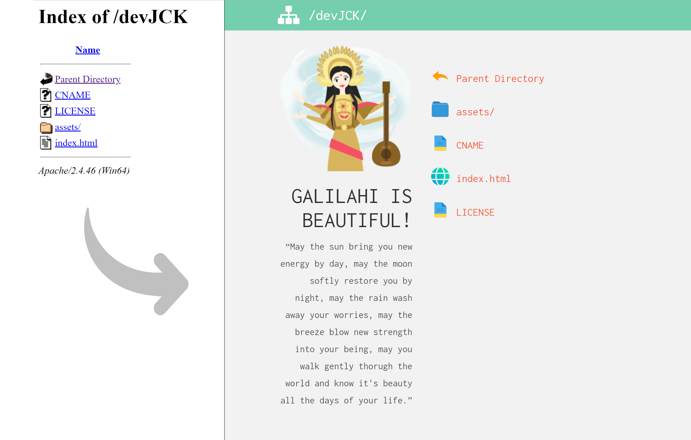

# Galilahi

Galilahi is a Bootstrap customisable theme built to enhance the experience of browsing web directories. It uses the `mod_autoindex` Apache module to override the default style of a directory listing.

Galilahi requires an Apache(2.2.11+) enabled HTTP server.

Galilahi illustration by [Manuela Langella](https://twitter.com/manuelalangella)

## Installation
* Copy and paste the contents of the `/galilahi` folder to your ftp folder - Be sure to merge the .htaccess file with the existing one if necessary